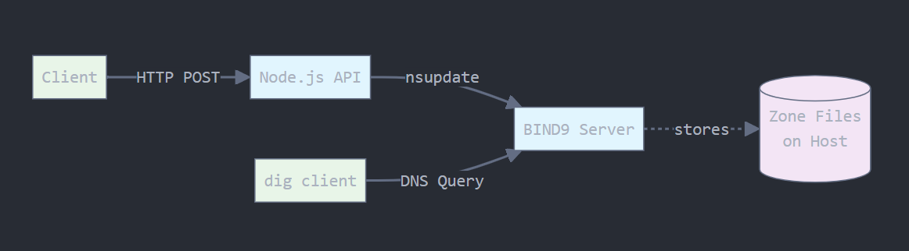

# Dynamic DNS Server with with Node.js API

## 📌 Introduction
This project is a full Proof of Concept (POC) for a Dynamic DNS system using BIND9 as the DNS server and Node.js as a REST API to add DNS records dynamically (e.g., A, CNAME, TXT). The setup runs in Docker with persistent storage and secure updates using TSIG keys.



The Node.js API acts as a bridge between HTTP requests and the BIND9 server, translating REST API calls into `nsupdate` commands. This allows web applications to manage DNS records programmatically without direct access to the DNS server.


## 🎯 Task Description
1. Run BIND9 DNS server inside a Docker container.
2. Set up the DNS zone to allow dynamic updates.
3. Use TSIG keys for secure updates.
4. Create a Node.js REST API to send dynamic DNS updates via `nsupdate`.
5. Support multiple record types (A, CNAME, TXT, etc.).
6. Dockerize the entire stack.
7. Test the setup using Postman and `dig`.


## 🧱 Project Setup: Folder Structure & Files

### 🔨 Step-by-step Setup

### Step 1: Create Project Folder
```bash
mkdir dynamic-dns-poc && cd dynamic-dns-poc
```

### Step 2: Create Folder Structure
```bash
mkdir -p bind/config bind/keys bind/zones
mkdir -p api/routes api/services api/utils
```

This structure separates the DNS server configuration from the API code. The `bind` directory contains all BIND9-related files, while `api` contains the Node.js application that will communicate with the DNS server.

### Step 3: Create BIND Config Files

#### `bind/config/named.conf`
```conf
include "/etc/bind/keys/update-key.key";

options {
  directory "/var/bind";
  listen-on port 53 { any; };
  allow-query { any; };
  recursion no;
};

zone "example.test" {
  type master;
  file "/etc/bind/zones/db.example.test";
  allow-update { key "update-key"; };
};
```

This configuration enables dynamic updates for the `example.test` zone. The `allow-update` directive restricts modifications to clients with the correct TSIG key, ensuring only authorized API calls can change DNS records.

#### `bind/zones/db.example.test`
```dns
$TTL 60
@ IN SOA ns1.example.test. admin.example.test. (
  2024061801 ; Serial
  3600       ; Refresh
  600        ; Retry
  86400      ; Expire
  60 )       ; Negative Cache TTL

  IN NS ns1.example.test.
ns1 IN A 127.0.0.1
```

#### Generate TSIG Key
```bash
cd bind/keys
```
Then either:

**Option 1** (Manual):
```bash
tsig-keygen -a hmac-sha256 update-key
```
Copy the output and save it to `update-key.key`:
```conf
key "update-key" {
  algorithm hmac-sha256;
  secret "somerandombase64string==";
};
```

**Option 2** (Auto file creation):
```bash
tsig-keygen -a hmac-sha256 update-key > update-key.key
```

The TSIG key acts as a shared secret between the API and DNS server. Both containers need access to this key file for authentication to work properly.


## 🚀 Node.js REST API Setup

### Step 4: Initialize Node Project
```bash
cd api
npm init -y
npm install express
```

### `api/index.js`
```js
const express = require('express');
const app = express();
const dnsRoutes = require('./routes/dns');

app.use(express.json());
app.use('/dns', dnsRoutes);

const PORT = 3000;
app.listen(PORT, () => console.log(`API server running on port ${PORT}`));
```

This creates a simple Express server that handles JSON requests and routes DNS-related endpoints to a separate router module.

### `api/routes/dns.js`
```js
const express = require('express');
const router = express.Router();
const dnsService = require('../services/dnsService');

router.post('/add', async (req, res) => {
  const { name, type, value } = req.body;
  try {
    await dnsService.addRecord(name, type, value);
    res.send({ message: 'Record added' });
  } catch (err) {
    res.status(500).send({ error: err.message });
  }
});

module.exports = router;
```

The router handles HTTP requests and delegates the actual DNS operations to a service layer. This separation makes the code more maintainable and allows for easier testing.

### `api/services/dnsService.js`
```js
const { exec } = require('child_process');
const path = require('path');
const { createAddRecordCommand } = require('../utils/nsupdateHelper');

exports.addRecord = (name, type, value) => {
  const keyFile = '/app/bind/keys/update-key.key';
  const update = createAddRecordCommand(name, type, value);

  return new Promise((resolve, reject) => {
    const cmd = `printf "${update}" | nsupdate -k ${keyFile}`;
    exec(cmd, (error, stdout, stderr) => {
      if (error) return reject(error);
      resolve();
    });
  });
};
```

This service executes the `nsupdate` command with the proper TSIG key authentication. The key file path `/app/bind/keys/update-key.key` corresponds to where Docker mounts the key file inside the API container.

### `api/utils/nsupdateHelper.js`
```js
exports.createAddRecordCommand = (name, type, value) => {
  return `server dns-server 53\nzone example.test\nupdate add ${name}.example.test. 60 ${type} ${value}\nsend\n`;
};
```

This utility generates the `nsupdate` command format. The `dns-server` hostname works because Docker Compose creates a network where containers can communicate using their service names.


## 🐳 Docker Setup

### Step 5: Create Dockerfiles

#### `Dockerfile.dns`
```Dockerfile
FROM internetsystemsconsortium/bind9:9.18
COPY config/named.conf /etc/bind/named.conf
COPY keys /etc/bind/keys
COPY zones /etc/bind/zones
RUN mkdir -p /var/bind && chown -R bind:bind /etc/bind /var/bind
```

#### `Dockerfile.api`
```Dockerfile
FROM node:18

# Install bind9utils for nsupdate
RUN apt-get update && apt-get install -y dnsutils bind9utils

# Setup app
WORKDIR /app
COPY . /app
RUN npm install

CMD ["node", "index.js"]
```

The API Dockerfile installs `bind9utils` which provides the `nsupdate` command. This allows the Node.js container to send DNS update commands to the BIND9 server.

### Step 6: Docker Compose

#### `docker-compose.yml`
```yaml
version: '3.8'
services:
  dns-server:
    build:
      context: ./bind
      dockerfile: ../Dockerfile.dns
    container_name: dns-server
    ports:
      - "8053:53/udp"
      - "8053:53/tcp"
    volumes:
      - ./bind/zones:/etc/bind/zones
      - ./bind/keys:/etc/bind/keys
    restart: always

  api:
    build:
      context: ./api
      dockerfile: ../Dockerfile.api
    container_name: dns-api
    volumes:
      - ./bind/keys:/app/bind/keys
    ports:
      - "3000:3000"
    depends_on:
      - dns-server
```

The volume mappings ensure both containers can access the TSIG key file. The `depends_on` directive ensures the DNS server starts before the API, though you may need to add health checks for production use.


## 🧪 Testing & Verification

### Step 7: Start the Stack
```bash
docker-compose up --build
```

The `--build` flag ensures Docker rebuilds the images if you've made changes to the Dockerfiles or application code.

### Step 8: Test the API

#### POST Request
- **URL:** `http://localhost:3000/dns/add`
- **Body Example A Record:**
```json
{
  "name": "www",
  "type": "A",
  "value": "1.2.3.4"
}
```
- **Body Example CNAME Record:**
```json
{
  "name": "blog",
  "type": "CNAME",
  "value": "www.example.test."
}
```
- **Body Example TXT Record:**
```json
{
  "name": "verify",
  "type": "TXT",
  "value": "google-site-verification=XYZ"
}
```
- **Command:**
```bash
curl -X POST http://localhost:3000/dns/add \
  -H "Content-Type: application/json" \
  -d '{"name":"www", "type":"A", "value":"1.2.3.4"}'
```

Each request type demonstrates different DNS record capabilities. A records map names to IP addresses, CNAME records create aliases, and TXT records store arbitrary text data often used for verification.

### Step 9: Query DNS Record
```bash
dig @127.0.0.1 -p 8053 www.example.test
```
Expected output:
- Corresponding DNS record for the entry added.

The `dig` command queries your local DNS server on port 8053 to verify that the API successfully added the record. You should see the IP address or value you specified in the API request.

### Step 10: Test Persistence
To test persistence:
```bash
# Stop and remove the stack
docker-compose down
# Start again
docker-compose up
# Query the same record
dig @127.0.0.1 -p 8053 www.example.test
```
If the record still exists, persistence works — this is because zone files are mounted using:
```yaml
volumes:
  - ./bind/zones:/etc/bind/zones
```
which ensures your updated zone file and its journal (.jnl) are stored on your host.


## 🔧 **Troubleshooting**

If you encounter the error `could not read key from /bind/keys/update-key.{private,key}: file not found`, check:

1. **Key file path**: Ensure the path in `dnsService.js` matches the Docker volume mount (`/app/bind/keys/update-key.key`)
2. **File existence**: Verify the key file exists in your local `bind/keys/` directory
3. **Container access**: Use `docker exec dns-api ls -la /app/bind/keys/` to check if the file is accessible inside the container

The path must match exactly where Docker mounts the volume inside the API container.


## ✅ Conclusion
You now have a working Dynamic DNS system with:
- BIND9 server inside Docker with dynamic updates
- Persistent volume for zones
- Node.js REST API for adding multiple types of DNS records (A, CNAME, TXT)
- Docker Compose for orchestration

The system provides a clean HTTP interface for DNS management while maintaining security through TSIG authentication. The containerized setup ensures consistent deployment across different environments.


